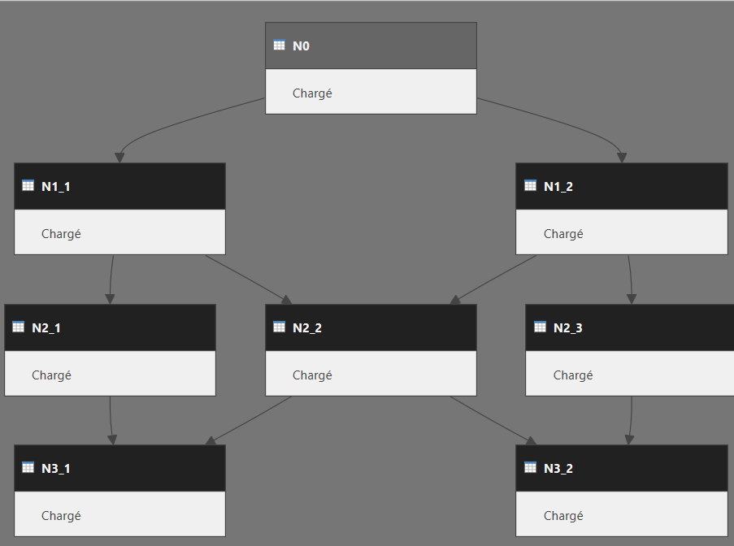
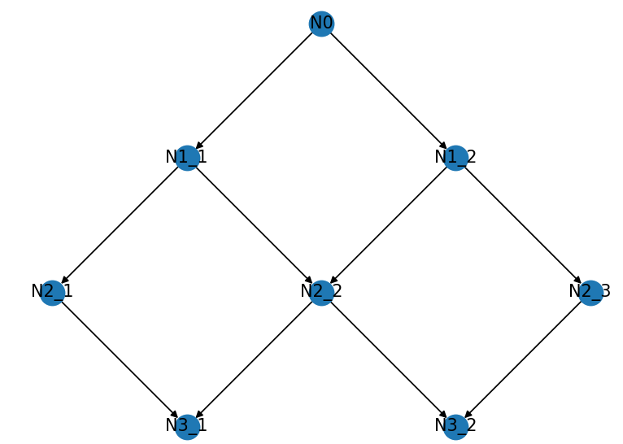

# PowerBi2Graph.py

## Overview

`PowerBi2Graph.py` is a Python script designed to extract, analyze, and visualize the data model schema of a Power BI template file (`.pbit`). This script reads the model schema, identifies the tables and their relationships, and constructs a directed graph to represent these connections using NetworkX and Matplotlib for visualization.

## Features

- Extracts the DataModelSchema from a `.pbit` file.
- Reads and parses the model schema in JSON format.
- Identifies tables (nodes) and their relationships (edges) within the Power BI data model.
- Constructs a directed graph (DiGraph) using NetworkX.
- Visualizes the graph with Matplotlib.

## Requirements

- Python 3.x
- `networkx` library
- `matplotlib` library

To install the required libraries, you can use pip:

```bash
pip install networkx[default] matplotlib
```

## Usage

### How to extract the PBIT file from your powerbi dashboard ?

Go to "File" -> "Export" -> "PowerBI model file"

### Import in your projects

To get the Digraph in your project, you'll need to use the function "get_model_digraph". \
get_model_digraph(filename, temp_folder (optional)) : 
- filename : Path to the "PBIT" file
- temp_folder : temporary folder where the content of the "PBIT" file will be extracted

Example: 
```python
from PowerBI2Graph import *
G = get_model_digraph("example.pbit", "temp")
```

### Command Line

Run the script from the command line:

```bash
python PowerBi2Graph.py [pbit_filename] [temp_storage_folder]
```

- `pbit_filename` (optional): The path to the Power BI template file. Default is `example.pbit`.
- `temp_storage_folder` (optional): The folder to temporarily store extracted files. Default is `model`.

Example :
```bash
python PowerBi2Graph.py my_dashboard.pbit temp_folder
```

### Script Output

- Prints the nodes (table names) and edges (relationships) of the graph.
- Displays a visual representation of the directed graph.

## Functions

### `extract_model_file(filename: str, output_folder: str)`

Extracts the `DataModelSchema` from the provided `.pbit` file into the specified output folder.

### `read_model_file(filename: str, temp_storage= "temp") -> dict`

Reads and parses the `DataModelSchema` from the extracted file and returns it in JSON format.

### `get_model_nodes(model: dict) -> list`

Extracts and returns a list of table names (nodes) from the model schema.

### `get_model_edges(model: dict, nodes: dict) -> list[tuple]`

Identifies and returns a list of tuples representing the edges (relationships) between tables.

### `get_model_digraph(filename: str, temp_storage: str)`

Generates and returns a directed graph (DiGraph) from the `.pbit` file.

## Example Code Execution

```python
if __name__ == "__main__":
    filename = "example.pbit"
    temp_folder = "model"

    if len(sys.argv) > 1:
        filename = sys.argv[1]
        if len(sys.argv) == 3:
            temp_folder = sys.argv[2]

    G = get_model_digraph(filename, temp_folder)
    
    print("Nodes:", G.nodes)
    print("Edges:", G.edges)

    nx.draw(G, with_labels=True)
    plt.show()
```

This script will read the specified Power BI template file, process the data model schema, create a directed graph representing the tables and their relationships, and display the graph using Matplotlib.

This is what the pbit file looks like in powerbi : 



And this is the output of the script(with nice positions for the nodes) :




## License

This project is licensed under the MIT License. See the LICENSE file for more details.


## Contributing

Contributions are welcome! Please feel free to submit a pull request or open an issue on the GitHub repository.